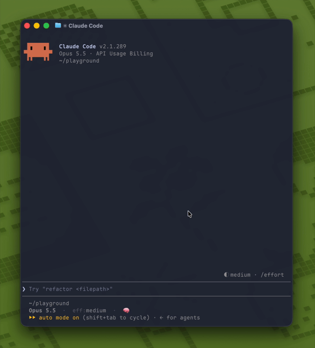

# claude-code-expand-paste

A Claude Code mod that expands collapsed clipboard text in the prompt,
so long input remains visible and editable instead of becoming
`[Pasted text #1 +42 lines]`.

<p align="center">
  
</p>

## Why use this?

Claude Code collapses long pasted text into a placeholder, hiding the content
you want to review before sending. This is especially frustrating when using
a dictation tool that pastes transcribed text from the clipboard: you cannot
immediately check whether your speech was transcribed correctly.

This mod expands the pasted text directly in the prompt, so you can read the
transcription, catch misheard words, and make corrections before sending it.
It also keeps other long pasted input visible and editable.

## Installation

Requires Claude Code v2.1.287 or later.

Run the following command in Claude Code:

```text
/plugin install expand-paste --marketplace tapioca24/claude-code-expand-paste
```

### Additional setup

On Linux, install the clipboard tool for your desktop session:

- **Wayland:** `wl-clipboard` (provides `wl-paste`).
- **X11:** `xclip` or `xsel`.

On WSL, if Windows command interoperability is unavailable, install a Linux
clipboard tool as described above.

## Usage

Paste into the prompt as usual. Clipboard-based input from a dictation tool can
also work.

Expansion is enabled by default. To change it, use the slash command:

| Command | Effect |
| --- | --- |
| `/expand-paste` | Toggle expansion and show the new state |
| `/expand-paste on` | Enable expansion |
| `/expand-paste off` | Disable expansion |

The setting persists across sessions and is also available in `/config`
(**Expand pasted text**).

## How it works

Claude Code first handles the paste normally. Every 250 ms, the mod checks the
prompt for a collapsed `[Pasted text #…]` placeholder. When one appears, it reads
the clipboard using the command for the current environment. If the clipboard's
newline count matches the placeholder and the placeholder was first seen within
the last second, the mod replaces it with the clipboard text. Line endings are
normalized to LF and tabs to four spaces. Existing text around the placeholder
is preserved.

The mod leaves individual edits and Claude Code's default paste processing alone.
It does not expand placeholders after the one-second window. If the clipboard
command cannot be used, it shows a message once per session and leaves the
placeholder unchanged.

## Known limitations

- Clipboard content must still be available when the placeholder is detected. If another app changes the clipboard first, expansion may fail or use different text with the same newline count.
- The one-second window starts when the placeholder is first detected, not when the paste occurred. A placeholder already present when the mod starts may be considered recent.
- Clipboard utilities or Windows command interop may be unavailable in remote, headless, or restricted environments.
